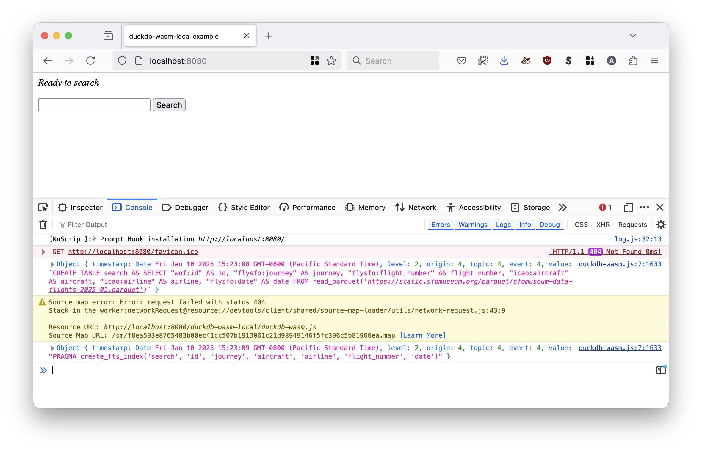
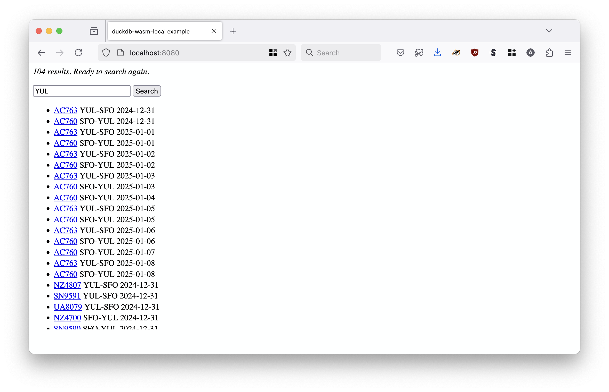

# www-duckdb-wasm-local

Demonstration website to test the duckdb-wasm WebAssembly (WASM) binary.

## Description

This is a simple website to test two things:

1. Understanding the syntax for using the [duckdb-wasm](https://github.com/duckdb/duckdb-wasm) (WASM) binary, including loading and using the [full-text search (FTS) extension](https://duckdb.org/docs/api/wasm/extensions.html).
2. Understanding what needs to happen to serve "all" of the assets to do so locally.

"All" is in air-quotes because so far as I understand DuckDB extensions are always loaded over the wire from the DuckDB servers.

## Example (basic)

_This is derived from the [`plain-html` code in the duckdb-wasm](https://github.com/duckdb/duckdb-wasm/tree/main/examples/plain-html) repository._

All of the assets for the website live in the `www` directory. You will need to "serve" this directory from a local web server. Everyone has their favourite way to do this. I like to use the `fileserver` tool which is part of the [aaronland/go-http-fileserver](https://github.com/aaronland/go-http-fileserver) package. For example:

```
$> fileserver -root ./www/
2025/01/10 15:17:12 Serving ./www/ and listening for requests on http://localhost:8080
```

Then opening a web browser to `http://localhost:8080` you should see something like this:



This will create and index a database table for performing full-text search of flights to and from SFO in January, 2025 using the [sfomuseum-data-flights-2025-01.parquet](https://static.sfomuseum.org/parquet/sfomuseum-data-flights-2025-01.parquet) database. Querying the data looks like this:



That's all this website does. As mentioned before it is a "demonstration" website to illustrate how things work and, more importantly, how more sophisticated applications might work.

## Notes

* All `*.wasm` files are tracked and stored using [git lfs](https://github.com/git-lfs/git-lfs).

## See also

* https://github.com/duckdb/duckdb-wasm